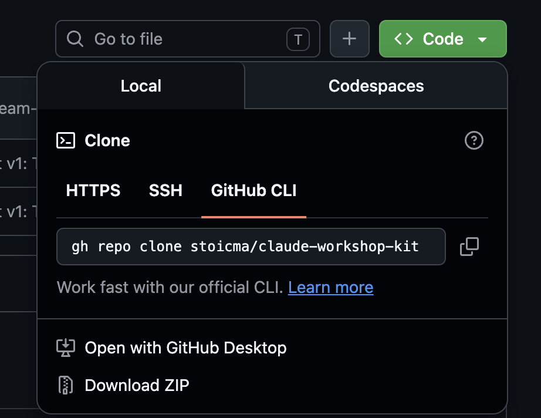

# Claude Workshop Kit

Das Begleitmaterial zum AI-Workshop. Hier liegt alles, was ihr während und nach den Sessions braucht: eine kurze CLI-Einführung, der Terminal-Spickzettel und das Deck-Template, aus dem ihr euren eigenen Folien-Skill baut.

Begleitlektüre zum Nachlesen: [stokic.ai/claude-guide](https://stokic.ai/claude-guide)

Fragen oder etwas klemmt: marko@stokic.ai

## Was ist hier drin

| Ordner / Datei | Was es ist |
|---|---|
| `README.md` | Diese Seite: CLI-Intro, Spickzettel, Anleitung |
| `team-deck-template/` | Der Folien-Skill, den ihr zwischen Session 1 und 2 auf euren Hausstil kalibriert |

## Kurz: Was ist ein Terminal, was ist ein CLI?

Das **Terminal** ist ein Textfenster, über das ihr euren Computer direkt steuert. Ein **CLI-Tool** (Command Line Interface) ist ein Programm ohne Knöpfe und Fenster, das in diesem Textfenster läuft. Claude Code ist so ein CLI-Tool.

Warum das für euch interessant ist: **Claude kann jedes CLI-Tool benutzen, das auf eurem Rechner installiert ist.** Je mehr solcher Tools da sind, desto mehr kann Claude für euch erledigen. Beispiel: Mit der **GitHub CLI** (`gh`, mehr dazu unten) kann Claude Projekte von GitHub holen, dort ablegen und veröffentlichen, wenn ihr es einfach auf Deutsch darum bittet. Ihr müsst die Befehle nicht lernen. Claude kennt sie.

Terminal öffnen:
- **Mac:** `Cmd+Leertaste` (Spotlight), „Terminal" tippen, Enter.
- **Windows:** Startmenü, „PowerShell" tippen, Enter.

## So holt ihr euch dieses Kit

Drei Wege, vom einfachsten zum elegantesten. Alle drei verstecken sich auf der GitHub-Seite hinter dem grünen **Code**-Knopf:



**Weg 1: ZIP herunterladen (kein Git nötig).** Grüner Code-Knopf, dann „Download ZIP", Datei entpacken, fertig. Der Ordner kann z.B. auf den Schreibtisch.

**Weg 2: `git clone` (machen wir in Session 1 gemeinsam).** Im Terminal:

```
git clone https://github.com/stoicma/claude-workshop-kit.git
```

**Weg 3: GitHub CLI.** `gh` ist das offizielle Kommandozeilen-Tool von GitHub, die Variante aus dem Screenshot oben (`gh repo clone ...`). Lohnt sich nicht am Tag eins, aber sobald es installiert und angemeldet ist, kann Claude damit für euch auf GitHub arbeiten: „leg dieses Projekt auf GitHub ab" wird dann ein einziger Satz. Installation und Anmeldung zeigen wir bei Bedarf, oder ihr fragt Claude (Regel Null, siehe unten).

Und falls sich das Kit später mal ändert: sagt Claude einfach „hol die neueste Version dieses Ordners von GitHub". Mehr Git braucht ihr nicht.

## Terminal im richtigen Ordner öffnen

Claude arbeitet immer in dem Ordner, in dem das Terminal gerade steht. Für den Deck-Skill muss das der Kit-Ordner sein. So kommt ihr hin:

**Mac:** Im Finder Rechtsklick auf den Kit-Ordner, dann „Dienste" und „Neues Terminal beim Ordner".

<!-- TODO Screenshot: Finder-Rechtsklick mit Dienste > Neues Terminal beim Ordner -->

**Windows 11:** Im Explorer Rechtsklick auf den Kit-Ordner, dann „Im Terminal öffnen".

<!-- TODO Screenshot: Windows-Explorer-Rechtsklick mit "Im Terminal öffnen" -->

**Falls der Rechtsklick die Option nicht zeigt:** Terminal öffnen, `cd ` tippen (mit Leerzeichen dahinter), dann den Kit-Ordner aus dem Finder bzw. Explorer direkt ins Terminal-Fenster ziehen, Enter.

Danach `claude` tippen, Enter, und es kann losgehen.

## Der Terminal-Spickzettel

Claude Code bedient sich wie ein Chat, nur im Terminal. Diese Handgriffe reichen für den Anfang.

**Vorab einmal:** aktuelle Version sicherstellen mit `claude update`. Die aktuelle Oberfläche könnt ihr mit der Maus bedienen (Befehle anklicken, in Dialogen klicken statt Pfeiltasten). Wer frisch installiert hat, hat sie schon.

| Handgriff | So geht's |
|---|---|
| **Modus wechseln** | `Shift+Tab` schaltet durch: Normal, Auto-Accept (Claude darf Dateien direkt ändern), Plan-Modus (erst denken und planen, nichts anfassen). Für den Anfang: Plan-Modus für alles Größere. |
| **Neue Zeile ohne Absenden** | `Shift+Enter` (funktioniert in Apple Terminal, Windows Terminal und den meisten modernen Terminals). Geht es nicht: `Ctrl+J` geht überall. In VS Code vorher einmal `/terminal-setup` ausführen. |
| **Screenshot einfügen** | Screenshot machen und kopieren, wie ihr es gewohnt seid. Dann im Terminal einfügen mit `Ctrl+V`. Die einzige Stolperfalle, auf dem Mac: `Ctrl+V`, nicht `Cmd+V`. Claude sieht das Bild und kann damit arbeiten. |
| **Claude unterbrechen** | `Esc` stoppt Claude mitten in der Antwort. Bereits Erledigtes bleibt erhalten. |
| **Zurückspulen** | Zweimal `Esc` (bei leerem Eingabefeld) öffnet das Rewind-Menü: zu einem früheren Punkt im Gespräch zurückspringen. |
| **Shell-Befehl direkt** | `!` am Zeilenanfang führt den Befehl direkt aus, ohne dass Claude ihn interpretiert. |
| **Hilfe** | `/help` zeigt alle Befehle. `/` allein öffnet das Befehlsmenü zum Durchklicken. |

**Und Regel Null:** Wenn ihr nicht wisst, wie etwas geht, fragt Claude selbst. „Wie füge ich hier einen Screenshot ein?" funktioniert.

## Die wichtigsten Slash-Befehle

Befehle, die mit `/` beginnen, steuern Claude Code selbst. Diese vier solltet ihr kennen:

| Befehl | Was er tut |
|---|---|
| `/resume` | Eine frühere Session fortsetzen. Jede Terminal-Session ist ein eigenes Gespräch; `/resume` zeigt die Liste der letzten und ihr macht weiter, wo ihr wart. |
| `/model` | Modell wechseln: schneller und günstiger für Alltagsaufgaben, gründlicher für komplexe. |
| `/config` | Einstellungen ansehen und ändern (Theme, Benachrichtigungen, Standardmodell). |
| `/insights` | Ein Bericht über eure eigene Nutzung: was ihr oft tut, wo ihr Zeit verliert, was sich zu automatisieren lohnt. Nach ein paar Wochen Nutzung sehr aufschlussreich. |

Eigene Befehle für eure wiederkehrenden Aufgaben (sogenannte Skills) sind genau das Thema des Workshops. Der erste eigene entsteht mit dem Deck-Template unten; die Konzepte stehen im [Claude Guide](https://stokic.ai/claude-guide).

## Der Deck-Skill (eure Hausaufgabe nach Session 1)

In `team-deck-template/` liegt ein Skill, der Folien im klassischen Beratungs-Look baut. Er ist absichtlich noch nicht auf euch eingestellt: beim ersten Aufruf stellt er euch sechs Fragen zu eurem Hausstil und kalibriert sich anhand eurer Referenz-Decks (die zwei aus der Checkliste).

So startet ihr nach Session 1:

1. Terminal im Kit-Ordner öffnen (siehe oben), `claude` starten
2. Sagen: „Lies team-deck-template/SKILL.md und führe das Kalibrierungs-Interview mit mir."
3. Den sechs Fragen folgen, eure zwei Referenz-Decks bereithalten
4. Ein erstes Deck zu einem echten Thema aus eurer Arbeit bauen lassen

Das Ergebnis bringt ihr in Session 2 mit. Steckenbleiben ist erlaubt, genau dafür ist die Session da. Aber schreibt mir vorher: marko@stokic.ai
